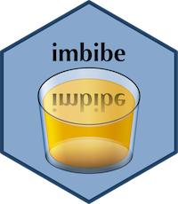

```{r, echo=FALSE}
knitr::opts_chunk$set(collapse=TRUE, fig.path="tools/figures/", dpi=150)
```

[](https://travis-ci.org/jonclayden/imbibe)

# imbibe: A pipe-friendly image calculator 

The `imbibe` [R package](https://www.r-project.org) offers fast, chainable image-processing operations which are applicable to images of two, three or four dimensions. It provides an R interface to the core C functions of the [`niimath` project](https://github.com/rordenlab/niimath), which is in turn a free-software reimplementation of [`fslmaths`](https://fsl.fmrib.ox.ac.uk/fsl/fslwiki/Fslutils), so it has its roots in medical image analysis and is particularly well-suited to such data. The package was designed from the outset to work well with the [pipe syntax](https://github.com/tidyverse/magrittr) widely popularised amongst R users by the [Tidyverse](http://tidyverse.org) family of packages.

## Installation

The package is not yet available from CRAN, and is currently somewhat experimental, but it can be easily installed using the `remotes` package.

```{r, eval=FALSE}
## install.packages("remotes")
remotes::install_github("jonclayden/imbibe")
```

## Usage


